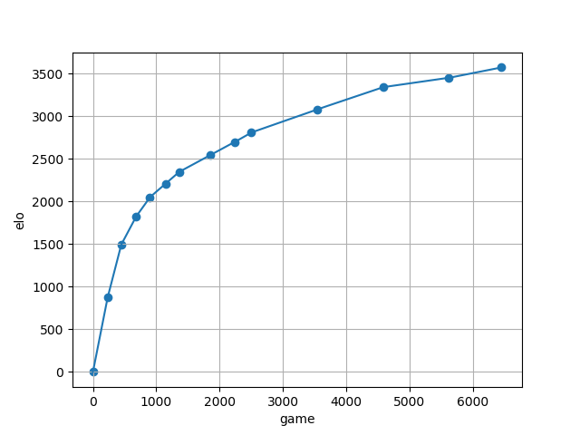
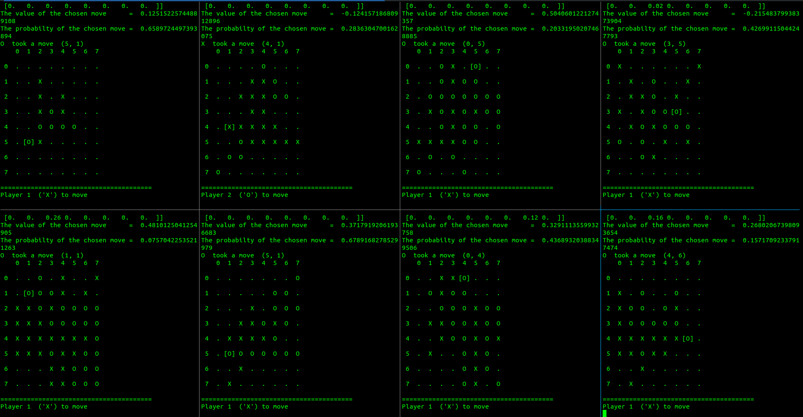
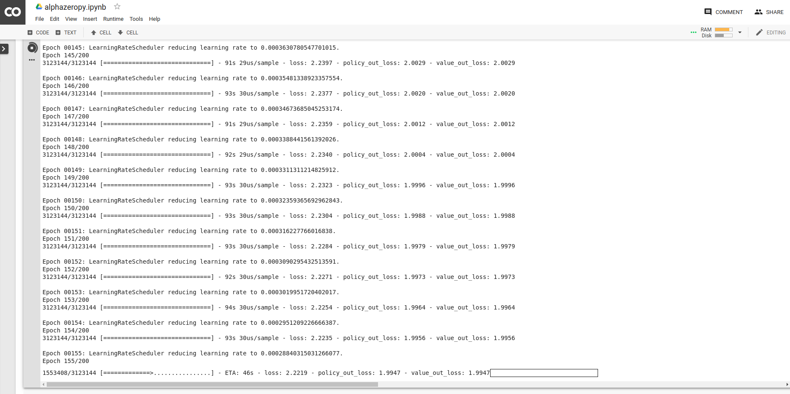

# alphazeropy
This is a python-based platform on which AlphaZero is implemented to train and play board games including Go, Gomoku, ConnectFour and Reversi.

# Features
1. python2 and python3 compatible code
1. possible to train the AI using tpu on colab
1. many board games on the same infra-structure
1. simple pygame gui inferface

# Major dependencies
1. tensorflow
1. pygame

For beginner, you may install it by pip.

```bash
pip install tensorflow pygame
```

If you want to build the tensorflow from source, feel free to visit my [note](https://medium.com/%E9%96%92%E4%BA%BA%E6%97%A5%E8%A8%98/build-tensorflow-2-0-from-source-with-gpu-and-tensorrt-supports-on-ubuntu-18-04-ce6e2edc31c) on medium.

# I just want to play

## Reversi
```bash
python play.py --game reversi --p1-brain reversi/trained_model/201904290601_reversi_board_8_8_res_blocks_10_filters_48
```

## Others
Coming soon!

### Training summary

I uploaded four AIs which have elo of 2051, 2542, 3083 and 3575.
Feel free to play against the current strongest AI which has played 6454 game.

# I want to train a model
1. Create a brain by 'make brain'
1. Open terminals to generate data by running 'make generate'
1. Train the model using latest game play by running 'make train'

# Snapshot

## Game generation
I generate the gameplay with 8 terminals.


## Training on TPU
TPU is awesome! It is at least 10 times faster than GPU!


# References
1. [AlphaZero: Mastering Chess and Shogi by Self-Play with a General Reinforcement Learning Algorithm](https://arxiv.org/abs/1712.01815)
1. [AlphaGo Zero: Mastering the game of Go without human knowledge](https://www.nature.com/articles/nature24270.epdf?author_access_token=VJXbVjaSHxFoctQQ4p2k4tRgN0jAjWel9jnR3ZoTv0PVW4gB86EEpGqTRDtpIz-2rmo8-KG06gqVobU5NSCFeHILHcVFUeMsbvwS-lxjqQGg98faovwjxeTUgZAUMnRQ)
1. [AlphaGo: Mastering the game of Go with deep neural networks and tree search](https://storage.googleapis.com/deepmind-media/alphago/AlphaGoNaturePaper.pdf)
1. [junxiaosong AlphaZero_Gomoku github](https://github.com/junxiaosong/AlphaZero_Gomoku/)
1. [Bayesian Optimization in AlphaGo](https://arxiv.org/abs/1812.06855)

